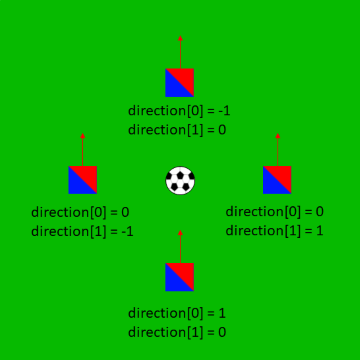
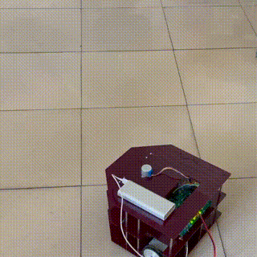

<h1 align="center">Control Digital Lab</h1>

**Professor**: Dr.Ali Talebi
, **Teaching Asistant**: AmirAli Setayeshi

**Team members:**
* Ali Entezari
* Pouya Ibrahimi
* Sevil Xojasteh
* Alireza Qolami

<h1 align="center">Exercise</h1>

## Goals
1. Controlling robot in 1 dimention using P and PI controllers
1. Controlling robot angle usign P and PI controller
1. Moving robot to the targeted coordination in 2 dimentions using P and PI controllers
1. Moving robot to the ball

## Robot physic
We use ***v*** and ***ω*** to design controllers but in reality we have to control robot with left and right motor. So we use these transforms:
```python
vr = (2*v + w*L)/(2*R)
vl = (2*v - w*L)/(2*R)
```
And there is a dead zone for real motors that we cannot get lower speed than a specific speed.


So we simulated it the soft way.
```python
if abs(vr) > offset:
    self.right_motor.setVelocity(vr)
else:
    self.right_motor.setVelocity(0)
if abs(vl) > offset:
    self.left_motor.setVelocity(vl)
else:
    self.left_motor.setVelocity(0)
```
for ease of use we wrote a function to do all these

```python
def set_v_w(v, w):
    L, R = 0.02, 0.085
    offset = 0.5
    vr = (2*v + w*L)/(2*R)
    vl = (2*v - w*L)/(2*R)

    if abs(vr) > offset:
        self.right_motor.setVelocity(vr)
    else:
        self.right_motor.setVelocity(0)
    if abs(vl) > offset:
        self.left_motor.setVelocity(vl)
    else:
        self.left_motor.setVelocity(0)
```
## Webots
The credit of soccer robot simulation is belongs to [Adman](https://github.com/Adman) from this repo [rcj-soccersim](https://github.com/RoboCupJuniorTC/rcj-soccersim)

The only difference is robot controllers.

To get the robot coordination there was a python dictionary variable named `ball_data` that has to keys named `strength` and `direction`. `strength` is the IR sensor output. it's reverse of distance. `direction` was an array with unknown normalized data between -1 and 1. with multiple tests understood they probably are sine and cosine of the angle between robot and ball.

| direction   |      angle      |
|:----------:|:-------------:|
|  |  |

## Goal #4 (following the ball)


To make it simpler we defined a `PI_controller` class, and used it for ball tracking. The ceoficients of Integrator (Ki) and Power (Kp) are beeing changed dependent to  relative location of robot and ball. e.g. we defined a flag named `turning_flag` for the situations that only ***ω*** speed is better for the robot. Another case is the distance between robot and ball, for distances more than 0.05 we use constant v with value of 0.75 but for less there is a PI controller.

### Known bugs
as we told
> with multiple tests understood they probably are sine and cosine of the angle between robot and ball

we're not sure what these variables exactly are, because they work like that most of the time but because of Webots or rcj-soccersim code bugs, sometimes they don't work like that and that causes unstablity of the robot. e.g. when robot is exactly behind the ball, `direction[1]` should be 0, but it's 0.8 and we don't know why.

<h1 align="center">Lab</h1>

## Goal
Connecting to raspberry pi (robot) using SSH and control it using keyboard (WSAD keys)




<h1 align="center">Project</h1>

## Goal
A soccer playing robot

The main algorithm inlcudes 2 main states:
1. following the ball
2. has the ball
    - attack
    - defend
### following the ball
using the algorithm in exercise the robot follows the ball until it reaches near the ball so we asume that the robot has the ball.

### has the ball
depends on the direction of the ball and the robot and the gate of teams, it defines to attack or defend.
In both cases the controller tries to go to oponent gate but the ceoficients of the controller are different.
for attack mode because the ball is between oponent gate and robot, it has high velosity to goal. for defend mode the ball is between the robot gate and it self, so it
uses low velosity to controll the ball to the other direction.
